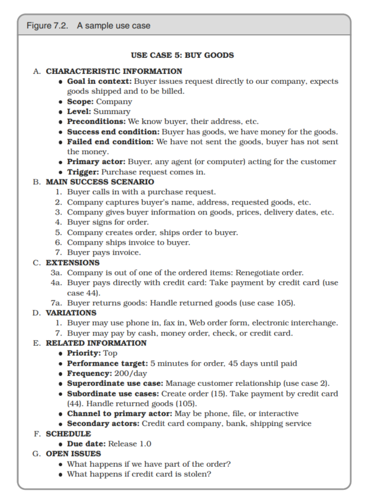

# Chapter 7 - Before the Project
## The Requirements Pit
__Perfection is achieved, not when there is nothing left to add, but when there is nothing left to take away....__ Antoine de St. Exupery

Requirements rarely lie on the surface. Normally, they’re buried deep beneath layers of assumptions, misconceptions, and politics.

Documenting the **reasons behind requirements** will give your team invaluable information when making daily implementation decisions.

**Work with a User to Think Like a User**

The requirements mining process is also the time to start to build a rapport with your user base, learning their expectations and hopes for the system you are building.

__Use cases__ is a concept to capture requirements. They let you describe a particular use of the system — not in terms of user interface, but in a more abstract fashion.

  

Don’t be a slave to any notation; use **whatever method best** communicates the requirements with your audience.

**Track** your requirements actively. This means to have report on changes of scope — who requested a feature, who approved it, total number of requests approved, and so on.

Create and maintain a **project glossary** — one place that defines all the specific terms and vocabulary used in a project. All participants in the project, from end users to support staff, **should use** the glossary to ensure consistency. This implies that the glossary needs to be **widely accessible** — a good argument for Web-based documentation.

## Solving Impossible Puzzles
The secret to solving the puzzle is to identify the real (not imagined) constraints, and find a solution therein. Some constraints are absolute; others are merely preconceived notions.

**Don’t Think Outside the Box—Find the Box**

Many times a reinterpretation of the requirements can make a whole set of problems go away. Ask yourself these questions:
- Is there an easier way?
- Are you trying to solve the right problem, or have you been distracted by a peripheral technicality?
- Why is this thing a problem?
- What is it that’s making it so hard to solve?
- Does it have to be done this way?
- Does it have to be done at all?

## Not Until You're Ready
You too need to listen to the voice that whispers "wait". Let your instincts contribute to your performance.

**Listen to Nagging Doubts—Start When You’re Ready**

Give it time and your doubts will probably crystallize into something more solid, something you can address.

How can you tell when you’re simply **procrastinating**, rather than responsibly **waiting for all the pieces** to fall into place? A technique that has worked for us in these circumstances is to start **prototyping**. Choose an area that you feel will be difficult and begin producing some kind of proof of concept.

## The Specification Trap
Writing a specification is quite a responsibility. The problem is that many designers find it difficult to stop.

**Some Things Are Better Done than Described**

Specification and implementation are simply different aspects of the same process — an attempt to capture and codify a requirement. Sometimes a picture is worth more than any number of words. Sometimes it is worthless.

## Circle and Arrows
**Don’t Be a Slave to Formal Methods**
We prefer, where possible, to show the user a prototype and let them play with it.

Pragmatic Programmers look at methodologies critically, then extract the best from each and meld them into a set of working practices that gets better each month. 