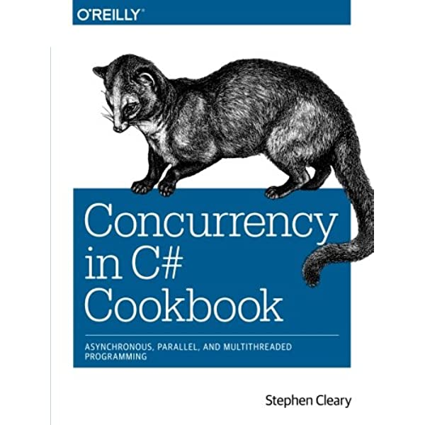

# Stephen Cleary - Concurrency in C# Cookbook
2014 edition

  

We are already at the point where concurrency is ubiquitous, and understanding these techniques and their uses is essential
knowledge for the professional developer.

Chapter 1 - Concurrency: An Overview

Chapter 2 - Async Basics

Chapter 3 - Parallel Basics

Chapter 4 - Dataflow Basics

Chapter 5 - Rx Basics